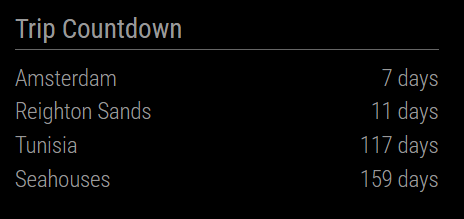

# MMM-HolidayCountdown

A [MagicMirror²](https://github.com/MagicMirrorOrg/MagicMirror) module that tracks the number of days until your next schedule trip. You can put as many trips in as you like but it will only show a day countdown for the soonest 4. A trip will dissaper from the display once it is past, it will be replaced with the next trip.




## Installation

Clone this module into your MagicMirror² modules folder:

```bash
cd ~/MagicMirror/modules
git clone https://github.com/TouaregWarrior/MMM-HolidayCountdown
```

## Configuration

There is only 1 field - hopefully easy to understand!
Just copy and paste additional entries to add trips!


Example config.js entry should look like

```js
  {
    			module: "MMM-HolidayCountdown",
    			position: "top_right",  // Or wherever you'd like it displayed
    			config: {
        			trips: [
					{ destination: "Amsterdam", date: "2024-10-02" },
					{ destination: "Reighton Sands", date: "2024-11-01" },
          			{ destination: "Tunisia", date: "2025-01-01" },
					{ destination: "Seahouses", date: "2025-02-03" },
        				]
    			}
		},
```

## Update

Go to the module’s directory and pull the latest version from GitHub:

```bash
cd ~/MagicMirror/modules/MMM-MortgageCountdown
git pull
```
